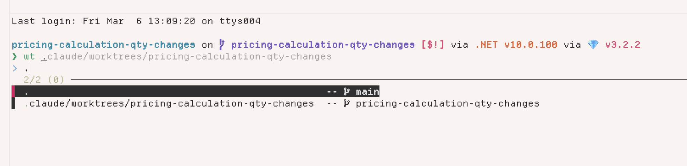

# git-worktree-switcher

Quickly switch between git worktrees using fzf.

Type `wt` to get a fuzzy-searchable list of your worktrees. Select one to `cd` into it.



## Prerequisites

- [fzf](https://github.com/junegunn/fzf)
- [gh](https://cli.github.com/) (optional — enables PR merge detection in `wt clean`)

## Installation

### Step 1: Install the core binary

```zsh
brew install jasonworden/tap/wt-core
```

Or build from source:

```zsh
cd rust && cargo install --path .
```

### Step 2: Install the zsh plugin

The plugin is a thin wrapper that provides shell integration (`cd`, fzf picker, tab completion).

#### zinit

```zsh
zinit light jasonworden/git-worktree-switcher
zinit cdreplay -q  # replay completions (needed for tab completion)
```

#### Oh My Zsh

Clone into your custom plugins directory:

```zsh
git clone https://github.com/jasonworden/git-worktree-switcher.git ${ZSH_CUSTOM:-~/.oh-my-zsh/custom}/plugins/git-worktree-switcher
```

Then add to your plugins list in `.zshrc`:

```zsh
plugins=(... git-worktree-switcher)
```

#### Antigen

```zsh
antigen bundle jasonworden/git-worktree-switcher
```

#### Manual

Source the plugin file in your `.zshrc`:

```zsh
source /path/to/git-worktree-switcher.plugin.zsh
```

## Usage

```
wt              # opens fzf picker
wt add <name>   # create a new worktree (and branch if needed)
wt clean        # review and batch-delete stale worktrees
wt clean --keep-branches  # delete worktrees but keep local branches
wt<tab>         # tab-complete worktree paths and subcommands
wt add <tab>    # tab-complete branch names
```

### fzf keybindings

| Key | Action |
|-----|--------|
| `enter` | Switch to selected worktree |
| `ctrl-a` | Create a new worktree (prompts for branch name, offers to open in editor) |
| `ctrl-o` | Open in editor (`$WT_OPENER`, default: `code`) |
| `ctrl-x` | Delete selected worktree (with confirmation) |
| `ctrl-g` | Open cleanup helper (`wt clean`) |

### Configuration

| Variable | Default | Description |
|----------|---------|-------------|
| `WT_OPENER` | `code` | Editor command used by `ctrl-o` |
| `WT_CLEAN_KEEP_BRANCHES` | unset | Set to `1` to keep local branches when cleaning |

### Local development

All dev commands work from the repo root (or any worktree). Use `make` or `npm run`:

```zsh
# Run everything — format check, lint, tests
make check              # or: npm run check

# Just tests
make test               # or: npm test
make test-rust          # or: npm run test:rust    (cargo test only)
make test-shell         # or: npm run test:shell   (shellspec only)

# Lint / format
make fmt                # or: npm run fmt     (check formatting)
make lint               # or: npm run lint    (clippy)
make fix                # or: npm run fix     (auto-fix both)

# Build
make build              # or: npm run build          (debug)
make build-release      # or: npm run build:release  (optimized)
```

#### Testing local changes in any repo

`wt-dev` rebuilds `wt-core` from source, updates your `PATH`, and reloads the plugin — so `wt` immediately uses your latest code. It works from any directory on your machine.

**One-time setup — add this alias to your `.zshrc`:**

```zsh
alias wt-dev='source ~/code/git-worktree-switcher/dev.sh && wt-dev'
```

> This uses a **lazy-load pattern**: the first call expands the alias, which
> sources `dev.sh` (defining the `wt-dev` *function*), then calls `wt-dev`
> (now the function). On subsequent calls, the function already exists and
> takes priority over the alias — so the alias effectively bootstraps itself
> out of existence. You get zero startup cost and no manual sourcing.

**Then from any directory, any repo:**

```zsh
wt-dev                              # auto-detect (if PWD is inside this repo)
wt-dev ~/code/git-worktree-switcher # build from main checkout
wt-dev ~/code/git-worktree-switcher/.claude/worktrees/feat-cmd-merge  # from a worktree
```

`wt-dev` resolves the build source in this order:
1. **Explicit path** if you pass one as an argument
2. **Current git root** if you're `cd`'d into this repo (or any of its worktrees)
3. **Last loaded location** (remembered from the previous `wt-dev` call)

After the first call, just run `wt-dev` again whenever you change code — no arguments needed.

Output looks like:
```
wt-dev: /Users/you/code/git-worktree-switcher/.claude/worktrees/feat-cmd-merge (branch: feat-cmd-merge)
wt-dev: rebuilt + reloaded
```

You can also verify exactly which build you're running:
```zsh
wt-core --version
# wt-core 1.0.0 (a98f888-dirty)
```

#### Prerequisites for development

- [Rust toolchain](https://rustup.rs/) (rustfmt, clippy included)
- [ShellSpec](https://shellspec.info/) for shell integration tests
- [fzf](https://github.com/junegunn/fzf) for the picker
